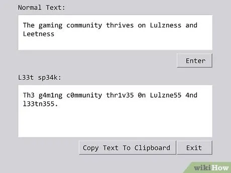

<h1><p align="center" font><bold>Leetspeak</bold></p></h1>

<p align="center">
  
</p>

<p align="center">
  <strong>A typeface and interactive showcase built around the hacker-culture Leetspeak substitution.</strong>
</p>

<p align="center">
  <a href="#demo">Demo</a> &bull;
  <a href="#features">Features</a> &bull;
  <a href="#usage">Usage</a> &bull;
  <a href="#the-cipher">The Cipher</a> &bull;
  <a href="#license">License</a>
</p>

---

## Overview

Leetspeak is a typeface and interactive web experience based on Leetspeak (also known as 1337), a substitution system that swaps letters for visually similar numbers and symbols. Originally used by hackers and early internet communities to evade text filters and signal insider status, it has since become a staple of online subculture. This project brings that playful encoding method into a modern, interactive digital format.

## Demo

[Live Demo](https://be-keb.github.io/LeetSpeak/) &mdash; Try the live encoder!

## Features

- **Interactive Live Encoder** &mdash; Type plaintext and watch it convert to leetspeak in real time
- **Substitution Matrix** &mdash; Visual grid showing every character mapping

## The Cipher

Leetspeak is a substitution system that replaces letters with numbers and symbols that resemble them:

| Plain | A | B | C | D | E | F | G | H | I | J | K | L | M |
|-------|---|---|---|---|---|---|---|---|---|---|---|---|---|
| Cipher| 4 | 8 | ( | D | 3 | F | 6 | # | 1 | J | K | 1 | M |

| Plain | N | O | P | Q | R | S | T | U | V | W | X | Y | Z |
|-------|---|---|---|---|---|---|---|---|---|---|---|---|---|
| Cipher| N | 0 | P | Q | 2 | 5 | 7 | U | V | W | X | Y | Z |

Because the substitution is not strictly one-to-one, some characters can map to multiple symbols and decryption relies on context. Common variants use `1` or `!` for I, `3` for E, `4` for A, `5` for S, `7` for T, and `0` for O.

## Usage

### Embedding the Font

The typeface can be used in any web project by including the font files and referencing them in CSS:

```css
@font-face {
  font-family: 'Leetspeak';
  src: url('fonts/Leetspeak-Regular.ttf') format('truetype');
}
